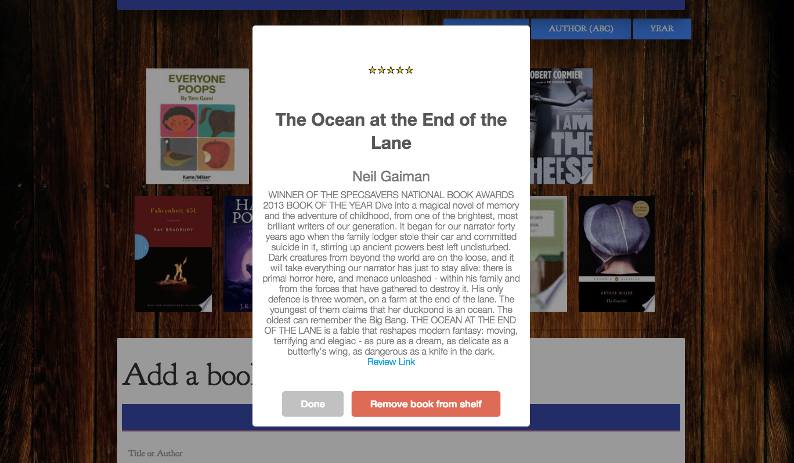

# Virtual Bookshelf

User can input a title or author and the web page will return a list of search results. After selecting the book they were looking by clicking on the item that best describes what they were searching for. The site then automatically renders the book cover onto your bookshelf. The user can now click on the book cover to get information about it ranging from authors to NY Times Star rating, etc. The person can also remove the book from their bookshelf if they choose to. 

# Screenshots 




## Technologies used

- Bootstrap
- Firebase db
- iDreamBooks API
- Google Books API
- Google Fonts
- Materialize
- Sweet Alerts

## Getting Started

heroku link: https://virtualbookshelf.herokuapp.com/

### Prerequisities

```
- Bootstrap: visit http://getbootstrap.com/ and link in html
- Firebase db: Initialize Firebase through google and use configuration key provided in js file
- iDreamBooks API: Create queryUrl with dynamic variable and use ajax call to get data from API
- Google Books API: Create queryUrl with dynamic variable and use ajax call to get data from API
- Google Fonts: visit https://fonts.google.com/ and link to html. Copy code provided and implement into css file
- Materialize: visit http://materializecss.com/getting-started.html and link in html
- Sweet alerts: visit http://t4t5.github.io/sweetalert/ and link to html

```

## Built With

* Sublime Text - Text editor of choice
* Bootstrap & Materialize - Wireframes of choice 
* Firebase - Makes removal and addition of new objects simpler
* Sweet Alerts - Modals used to simplify design

## Walk throughs of code 

Clicking books on shelf to grab info

```
$(document).on('click', '.bookInfo', function(){
  console.log(this);
  var currentBook;
  var that = this;
  var displayTitle = $(this).data('title');
  var displayAuthor = $(this).data('author');
  var displaySummary = $(this).data('description');
  var displayLink;
  var displayStars;
  var link;

  Limits id grab from Firebase by the one that matches title selected

  database.ref().orderBy Child("title").equalTo(displayTitle).limitToFirst(1).on("child_added", function(snapTest) {
    currentBook = snapTest.key;
    console.log(currentBook);
    database.ref().child('currentBook').remove();
    displayLink = snapTest.val().reviewLink;
    displayStars = snapTest.val().starRating;
    console.log(displayLink + " " + displayStars);
    
    if (displayLink == 'no reviews'){
      link = "No review.";
    } else{
      link = "Review Link";
    }
  });

```

## Authors

*  **Krishna Yallayi** - *Dreambooks API & Sorting Function* - [Krishna](https://github.com/darthvader1118)
*  **Mario Aburto** - *Firebase & GoogleBooks API* - [Mario](https://github.com/marioaburto10)
*  **Muhammet Aydin** - *Dreambooks API, sweetalert, Debugging* - [Muhammet](https://github.com/muhammeta7)
*  **Stefanie Ding** - *Google Books API, HTML, CSS, JS files, Debugging* - [Stefanie](https://github.com/StefanieDing)


## Acknowledgments

* Thanks to all of the the team members for their contributions to this project.
* Also thanks to Dan, Nate, Jimmy, and Quincy for all their help.  
* Inspiration: To help people who frequently read but forget which books they may own or already have.
  
